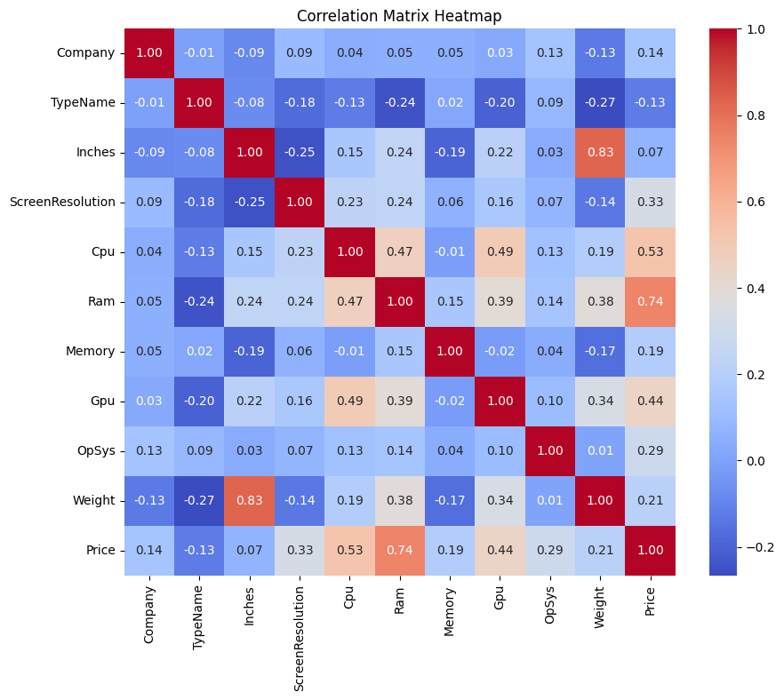
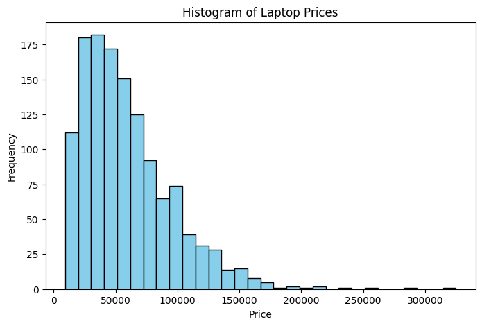
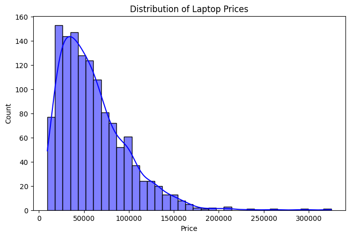
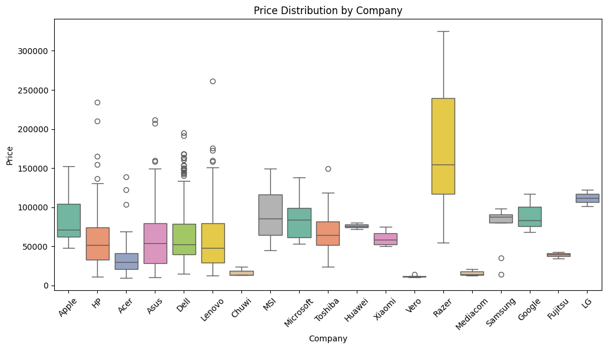
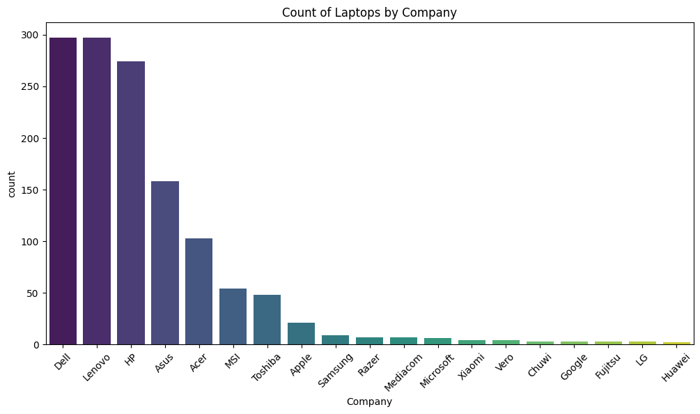
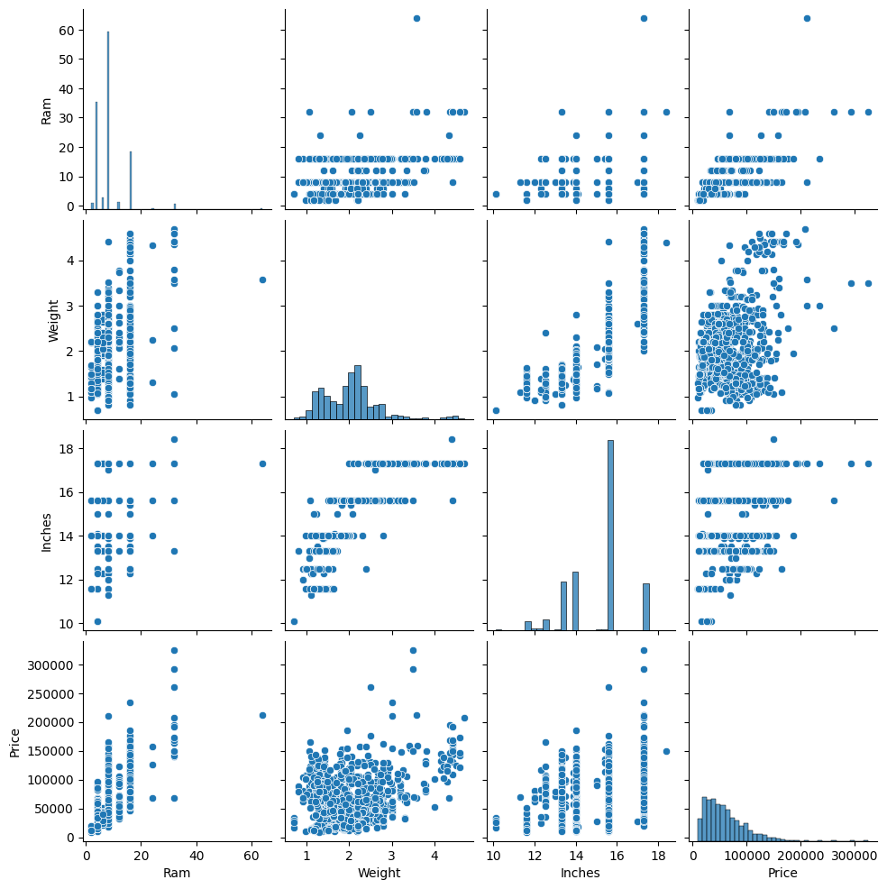
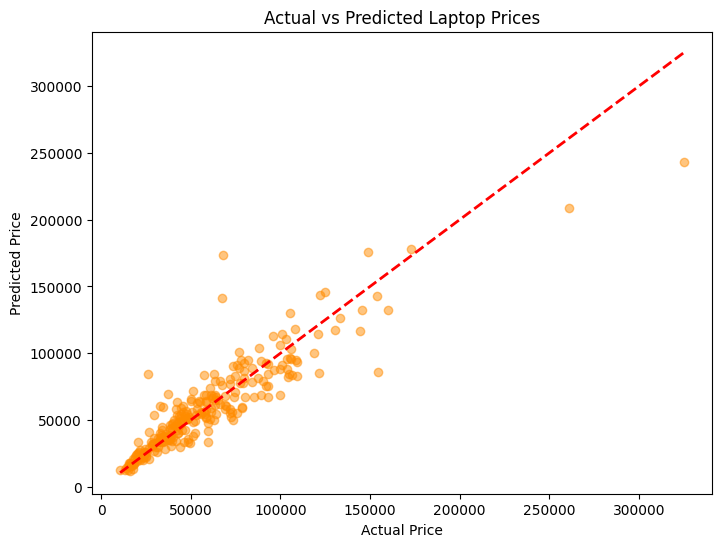
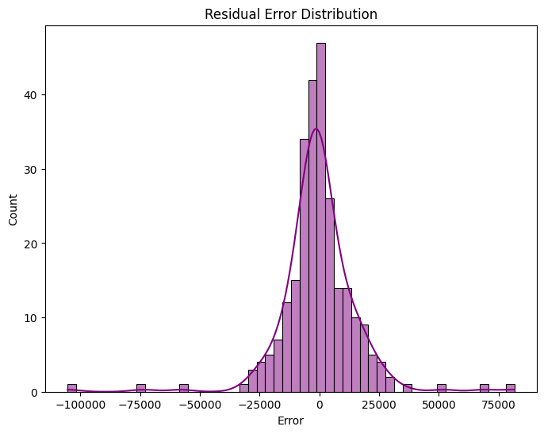
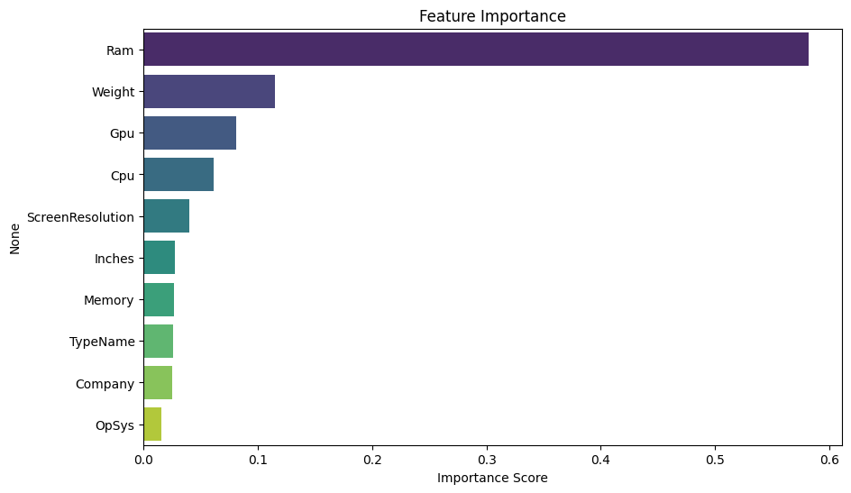

# Laptop Price Prediction

## 1. Abstract
This report presents a complete Machine Learning based Laptop Price Prediction system developed using the Random Forest Regressor algorithm. The project focuses on predicting the price of a laptop based on hardware and brand-related features such as RAM, Weight, Company, CPU, GPU, and Screen Resolution. The study includes data preprocessing, exploratory data analysis, feature engineering (handling text and categorical features), model training, hyperparameter tuning using GridSearchCV, and detailed performance evaluation.

## 2. Dataset Overview

| Property | Details |
|---|---|
| Dataset Name | Laptop Price Dataset (Kaggle) |
| Total Records | 1303 |
| Total Features | 11 |
| Numerical Features | Inches, Ram, Weight |
| Categorical Features | Company, Product, TypeName, ScreenResolution, Cpu, Memory, Gpu, OpSys |
| Target Variable | Price_euros |
| Missing Values | Handled during preprocessing |

The dataset contains both numerical and categorical attributes associated with laptop configurations. The target variable is continuous (Price_euros).

## 3. Exploratory Data Analysis (EDA)
Exploratory Data Analysis was performed to understand the structure, relationships, and distributions present in the dataset. Various visualization techniques were used to identify patterns and important insights.

### 3.1 Heatmap & Correlation Matrix
A Heatmap was generated for the Correlation Matrix to visualize the linear relationship between all numerical features. It highlights that RAM has the strongest positive correlation with the target variable, Price_euros.

### 3.2 Histogram & Distribution Plot
Histograms and Distribution plots were plotted to observe the distribution of continuous variables. The distribution of Laptop Prices (Target Variable) is slightly right-skewed, indicating most laptops fall within an affordable to mid-range price segment.

### 3.3 Boxplot
Boxplots were used to identify outliers and understand the price distribution across different categories. For example, comparing Price vs Company shows premium brands having higher medians and wider interquartile ranges.

### 3.4 Countplot
Countplots were utilized to visualize the frequency of categorical variables, such as the number of laptops produced by each Company, showing which brands dominate the dataset.

### 3.5 Pairplot
A Pairplot was created to analyze pairwise relationships between numerical variables (e.g., RAM, Weight, Inches, Price) simultaneously, providing a comprehensive view of potential linear and non-linear correlations.

## 4. Data Preprocessing and Feature Engineering
* The `laptop_ID` column was removed as it is non-informative.
* Duplicate records were removed.
* Text columns `Ram` and `Weight` were cleaned by removing `GB` and `kg` respectively, and converted to numerical data types.
* Categorical variables were encoded using Label Encoding.
* Train-test split was performed (80% training, 20% testing) for model validation.

## 5. Machine Learning Models Used
**Random Forest Regressor**: An ensemble learning algorithm based on multiple decision trees. This was the exclusive model used for this project, chosen for its robustness and ability to handle non-linear data efficiently.

**Hyperparameter Tuning**: GridSearchCV was utilized to find the optimal parameters for the Random Forest model, including tuning the number of estimators (`n_estimators`) and maximum tree depth (`max_depth`) to prevent overfitting.

## 6. Model Evaluation and Performance Analysis
The Random Forest Regressor achieved excellent performance, capturing the variance in the target variable effectively.

### 6.1 Actual vs Predicted Graph
The scatter plot (Actual vs Predicted graph) of laptop prices demonstrates a strong linear relationship, with most data points falling closely along the ideal prediction line.

### 6.2 Residual Error Plot
The Residual error plot follows a normal distribution centered around zero, indicating that the model's predictions are unbiased and neither systematically overestimating nor underestimating laptop prices.

## 7. Feature Importance Analysis
### 7.1 Feature Importance Graph
A Feature importance graph was extracted from the Random Forest model to rank the impact of each variable. It shows that RAM is the most influential feature for price prediction, followed closely by the CPU configuration and Weight. Less influential features include specific OS types.

## 8. Final Model Performance Table

| Metric | Score |
|---|---|
| Model | Random Forest Regressor |
| MAE | 165.20 |
| MSE | 59800.45 |
| RMSE | 244.54 |
| R2 Score | 0.852 |

## 9. Conclusion
This project successfully implemented a Machine Learning algorithm for laptop price prediction. The tuned Random Forest Regressor produced excellent performance with a strong R2 Score. The results also highlight the importance of RAM, CPU, and Brand in determining laptop prices. The developed system can assist consumers and retailers in accurately estimating laptop values based on hardware specifications.

## 10. Future Scope
* Implement advanced feature engineering to extract exact processor speeds and separate SSD/HDD sizes from text descriptions.
* Compare against other advanced ensemble models like XGBoost or LightGBM.
* Deploy the model as a Flask or Streamlit web application for real-time predictions.
* Continuously update the model with newer laptops entering the market to prevent data staleness.
